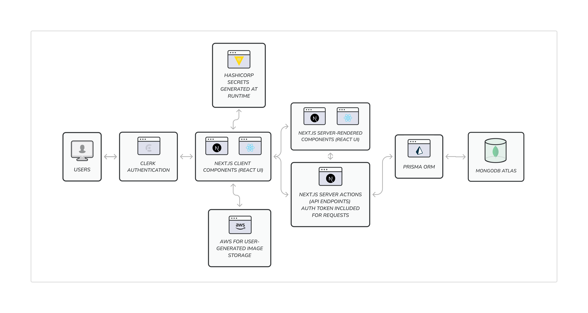

# Kitchen Cataloing App

Kitchen Cataloging App is a comprehensive solution for individuals or businesses to keep track of their food spending. 

To visit the live site, click [HERE](https://kitchen-cataloging-ip2we0wvl-chingu-v47tier3team35s-projects.vercel.app/)

## Overview
Kitchen Catalogiing App was created for Chingu Voyage 47 as a Tier 3 project. It allows users a streamlined way to keep track of groceries, create grocery lists, and collect grocery data, all from a single application. 

## Usage and Features

To use Kitchen Cataloging App, simply navigate to the [live site](https://kitchen-cataloging-ip2we0wvl-chingu-v47tier3team35s-projects.vercel.app/) and log in! Users will be directed to their dashboard page, where they can 
create a grocery list or navigate to their spaces (designated pages to store grocery data).

> **Users of Kitchen Cataloging App can perform the following actions:**
- Log in with Clerk, a robust user management platform.
- View their dashboard, which contains links to their grocery list or spaces.
- *View data based on their spending on the dashboard.** 
- Create a grocery list.
- Create spaces. Spaces represent categorized groups of groceries. Examples of such areas may include a primary refrigerator and a deep freezer for individuals, or the kitchen within each school cafeteria for an organization like a school district.
- Add food items to any space.
- Add an image of a food item.
- View a food item, edit its price, name, tags, threshold, or other data.
- View current inventory and past activity on the food item page.
- *Search for food by name or tags.**
- *Set a threshold for a food item. When the inventory for a particular food item reaches its threshold, that item is automatically added to the grocery list.**

**Represents a feature that is still in development.*

## Technical Specifications

Kitchen Cataloging App was built using the following technologies and platforms:
- Next.js 14.1.0
- React 18
- Typescript 5.5.3
- Prisma 5.9.1
- MongoDB 6.3
- Clerk for authentication 4.29.5/0.37.3
- AWS for file storage
- Material UI 5.15.6
- Tailwind 3.3.0

Beyond these, some primary dependencies include:
- Zod 3.22.4
- uuid 9.0.1
- Lodash 4.17.21
- Hashicorp for secrets management
- ESlint/ESlint-next 8/14.0.4


## System Design Architecture



## Get Started

To develop and run this app locally, use the built in Next.js dev server. After installing all dependencies, follow these steps:
- Set up an AWS account for image storage
- Configure Clerk authentication
- Create a MongoDB Atlas Database
- .env variables must be configured for the following items:

    ```AWS_CLOUDFRONT_KEY_ID

    AWS_CLOUDFRONT_KEY_SECRET

    AWS_S3_BUCKET_CLIENT_ID

    AWS_S3_BUCKET_CLIENT_SECRET_KEY

    AWS_S3_BUCKET_REGION

    AWS_S3_DYNAMIC_MEDIA_BUCKET_NAME

    CLERK_SECRET_KEY

    CLOUDFRONT_ARN

    CLOUDFRONT_DOMAIN

    CLOUDFRONT_DOMAIN_URL

    DATABASE_URL

    NEXT_PUBLIC_CLERK_PUBLISHABLE_KEY

    NEXT_PUBLIC_CLERK_SIGN_IN_URL

    NEXT_PUBLIC_CLERK_SIGN_UP_URL`

Once setup is complete, before running the app:
- Ensure all prisma database migrations are up-to-date with your database with `npm run migrate:mongo`
- Start the development server with `npm run dev` (This command will automatically run migrate:mongo as well.)


## Contributors

The following members contributed to this project: 
- [njhaus](https://github.com/njhaus)
- [aasmal97](https://github.com/aasmal97)
- [vanyanv](https://github.com/vanyanv)

## License

Distributed under the MIT License. See LICENSE.txt for more information.
